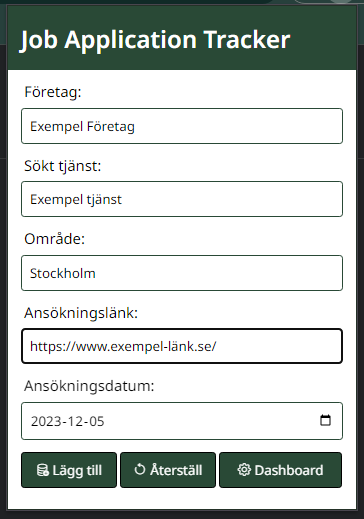
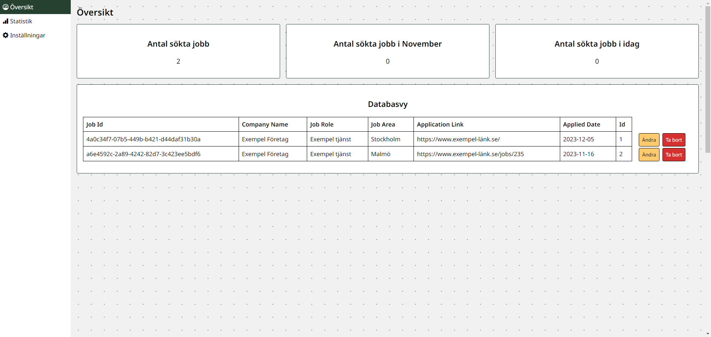
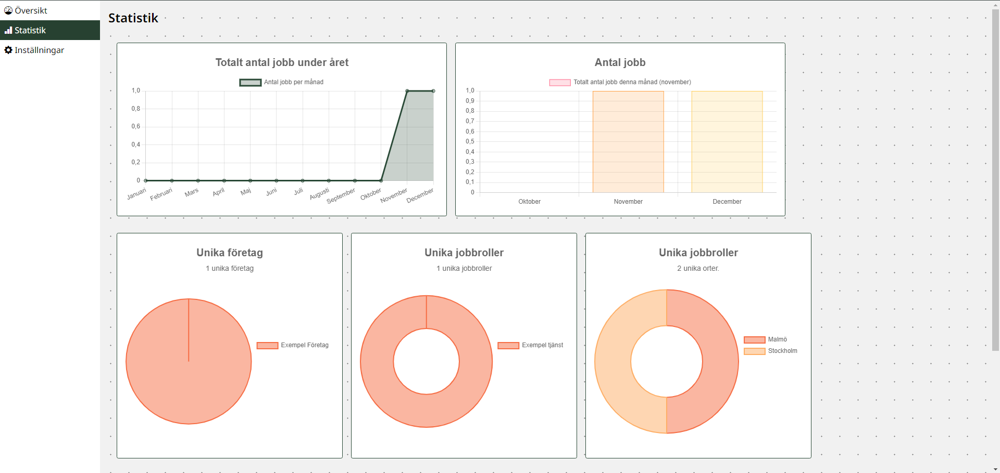

# J.A.T ( Job Application Tracker )

J.A.T is a browser extension(only chrome for now.) that helps you keep track of the jobs that you apply for.
J.A.T uses IndexDB to store your job applications locally on your machine which means no personal data will be sent to any type of server.
Do keep mind because IndexDB is being used as a database, it can be easily erased by the user by clearing your cache in your web browser (Same as clearing your cookies.)

# How to use J.A.T
1. clone the repo.
2. while inside the cloned repo, open up your preferred terminal and type ```npm run build```
3. Open Google Chrome and navigate to chrome://extensions.
4. Click on 'load uncompressed extension', navigate to the cloned repo folder and select the 'dist' folder.
5. You should now have J.A.T installed in your web browser, simply click the boat icon the upper right corner and start inputting the details of your job application.

# Libraries used
-  Chart.JS for charts & diagrams.
-  idb for interfacing with IndexDB


# Screenshots
### Popup


### Dashboard / Overview


### Statistics

